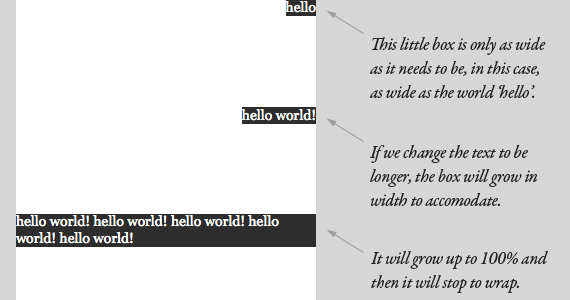
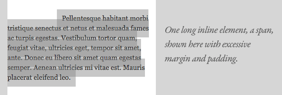

## CSS Box model

Jeżeli nie ustawimy width dla elementu blokowego to jego width wynosić będzie 100% a padding i border "wciśnięte" zostaną do środka. Natomiast kiedy ustawimy width: 100% to element zajmie 100% szerokości rodzica a padding i border zostaną wypchnięte na zewnątrz.

Tak więc domyślne width to tak naprawdę nie jest 100% a raczej cała przestrzeń jaka została do zagospodarowania.


W przypadku elementów **pozycjonowanych absolutnie**, domyślna szerokość jest minimalną szerokością jakiej potrzebuje content.



Taki element będzie poszerzał się wraz z powiększaniem się zawartości aż osiągnie 100% szer. rodzica (najbliższego elementu pozycjonowanego relatywnie lub okna przeglądarki) i następnie zacznie zawijać treść.

Dokładnie taka sama sytuacja ma miejsce w przypadku elementów  float i bez określonej szerokości.

Elementy **inline** możemy traktować jako bardzo długie i wąskie prostokąty, które się zawijają do nowej linii. Dlatego jeśli spanowi nadamy margin-left to przesunięta zostanie tylko pierwsza linia, a jeśli nadamy padding, to zostanie on nadany w każdej linii.



Jeśli chcesz zobaczyć granice boxów to:

```css
* {
   outline: 1px solid red !important;
}
```